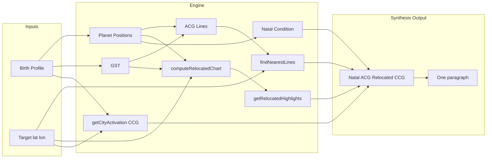

# Location Synthesis Data Flow

The app builds a single “Your story here” narrative per city by layering: **Natal Promise** → **ACG lines** → **Relocated houses** → **CCG (timing)**.

## Acronyms

- **ACG** = Astrocartography. The planetary lines on the map (planet conjunct ASC/DSC/MC/IC).
- **CCG** = Cyclocartography. Timing — when transits and progressions activate those lines.

## Pipeline

Keep this diagram updated when the synthesis pipeline changes.

## Key modules

- `lib/relocatedChart.ts` — `computeRelocatedChart`, `getRelocatedHighlights`, house themes.
- `lib/natalCondition.ts` — natal aspects and dignity per planet for synthesis.
- `lib/synthesis.ts` — `getLocationSynthesis`, `buildSynthesisParagraph`.
- City Detail uses synthesis for the “Your Story Here” block; parans appear as “Latitude highlights”.
